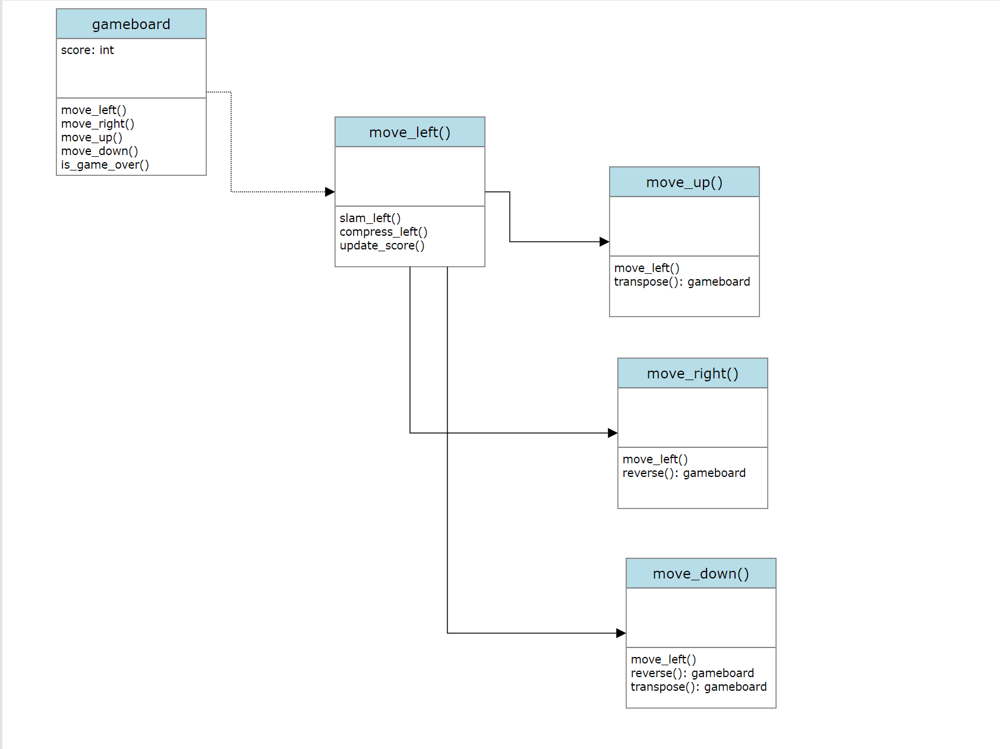

# Design Mini Arcade Game

## High Level Design

### GUI game flow

### Usecase Diagram

### Activity Diagram

### Object Diagram

## Low Level Design

### Package Diagram

### Flowchart

### Class Diagram

