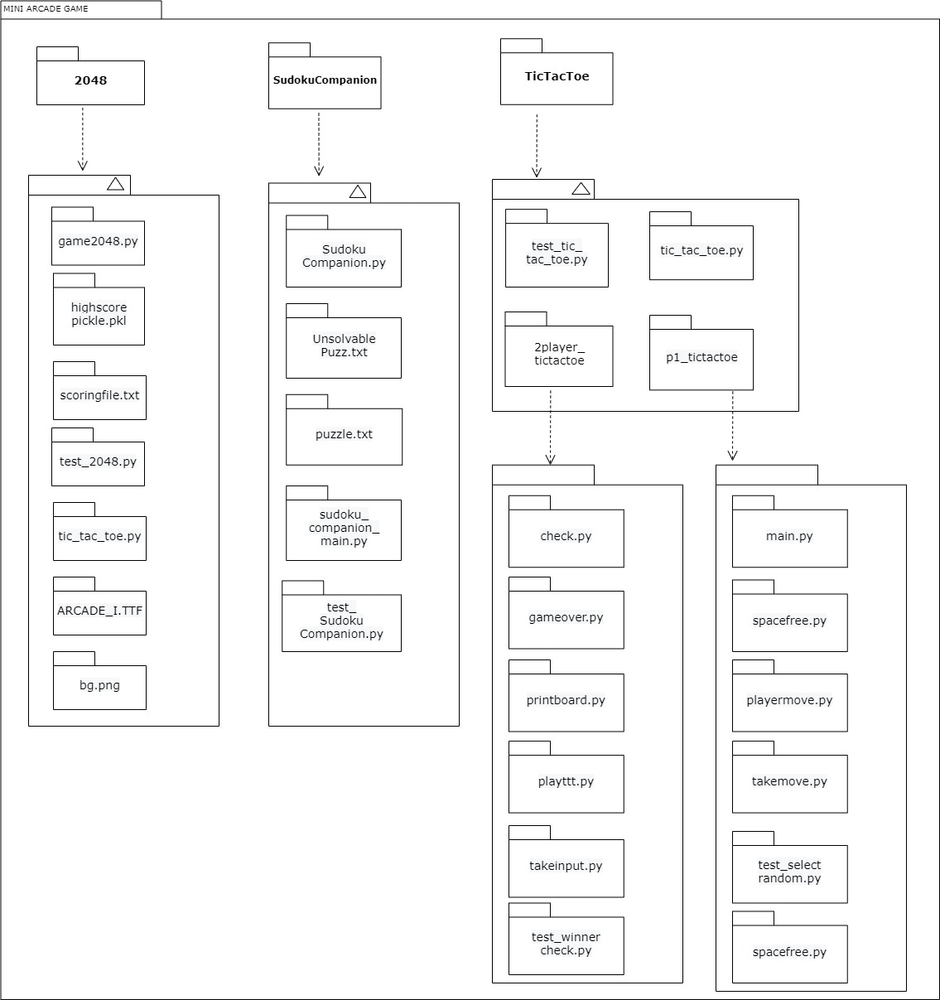

# SDLC Mini Arcade Game
| Unit Test | Code Quality| Git Inspector| Coverage |
|-----------|-------------|--------------|----------|
|||||
||
||
||

## Demo

## Running the program
Navigate to the directory containing this project after cloning from the terminal. Run the following commands:
* `cd 3_Implementation/`
* `python game2048.py` to launch GUI games, includes all 2 GUI games + 1 console game
* `python main.py` to launch console game seperately

### Note:
1. Please install the `ARCADE_I.TTF` font present in the `3_Implementation/` directory, just open the font file to install it.
2. Install the following pip packages: `turtle`, `pickle`, `mock`.

        pip install pickle-mixin
    
        pip install turtle
        
        pip install mock

4. For Sudoku Companion have the sudoku game as comma separated text file like `3_Implementation/SudokuCompanion/puzzle.txt`.

## Folder Structure

|         Folder    	  | 			Description 		    |
| ----------------------- | ----------------------------------------------  |
| 	1_Requirements    | Documents detailing requirements and research   |
| 	2_Design	  | Documents specifying design details        	    |
| 	3_Implementation  | All code and documentation        		    |
| 	4_test_plan	  | Documents with test plans and procedures        |
| 5_Report       | Folder consisting of documentation of the project 
| 6_ImagesAndVideos   | Images and Videos 

## Contributors List and Summary

PS No. |  Name   |    Features    | Issues Raised |Issues Resolved|No Test Cases|Test Case Pass
-------|-------------|----------------|----------------|---------------|-------------|--------------
`99005667` | Swathi  Ramachandran |  Tic-Tac-Toe 1 Player : Multifile, Unit tests, Testplan, Low level requirement, Object diagram |      | 1 | 7  | 7
`99005660` | Bhargav  R | SudokuCompanion: FileI/O, Grid Representation and Providing Hint Feature Few, Unit Tests and Few HLR and LLR | 1    |    | 8  | 8  
`99005364` | Prakhar  Deep (263998) |  Tic-Tac-Toe 2 player : Multifile, flowchart, low level requirement  |      |   1 |   2|   2 
`99005468` | Ayush  Bishnoi |  2048 game engine and binary score keeper   |      |    |11    | 11    
`99005584` | Saurav  Raja  |SudokuComapanion:Usecase UML,Flowchart,Testplan and Implementation     |      | 1   |   |
`99005637` | Prajwal  M| Tic-Tac-Toe : Requirements,Class diagram UML, Testplan and Implementation     |      |    | 1  | 1
`99005638` | Kamarthi Vignesh  Sai | Tic Tac Toe game, Activity diagram, Flowchart     |      |    | 1  | 1   
`99005688` | Tankasala  Gaanalola  | Tic Tac Toe, Requirements - SWOT Analysis, 4 W's 1H, SudokuCompanion:UML Class diagram     |      | 0   | 0  |  
`99005679` | Annappa  M | SudokuCompanion: Sudoku Grid Issolvable logic, Solver Logic, Usecase UML,Testplan,few LLR and 2 unit tests   |      | 1   |2    |2    
`99005635` | Yaseer Faiz Ahmed |Menu GUI, 2048 GUI, TicTacToe GUI, integrating all game files to work together |      |    |0   | 0

## Challenges Faced and How Was It Overcome

1. Faced issues with integrating the modules because each of us had a different coding style. But eventually, reading through code and undersanding it helped us modify it and integrate it accordingly.
2. Testing was something new to each and everyone of us in Python. We had to start from scratch and learn how to write test files for python programs.
3. Following and keeping track of every process in SDLC was very difficult. With constant support and hardwork, we were able to atleast keep up with atleast half of it.
4. Working within the time constraint was difficult.

## Contributions of individual team member

# REQUIREMENT MD FILE

## Introduction

To design a Mini Arcade game system to play 2048, Sudoku and Tic-Tac-Toe(1 player and 2 player) games based on user choice.

## Research

It is an all-in one gaming platform for various games where user can access different types of games in single application.

### Tic-Tac-Toe 
Tic-Tac-Toe is a well known game played by two
persons who alternately place X's and O's upon a 3x3 playing field.
The players first decide who will mark his moves
with an X and who will go first. Play proceeds with the opponents
alternately placing their marks in any unoccupied cell 
The object of the game is to be the first player with 3
marks in a row, where a row can be either vertical, horizontal, or
diagonal. If all the cells become filled the game is a draw.

To win the game, a player must place three of their marks in a horizontal, vertical, or diagonal row.

The following example game is won by the first player, X:

### Sudoku Companion

Sudoku is a logic-based, combinatorial number-placement puzzle.The standard version of Sudoku consists of a 9×9 square grid containing 81 cells. The grid is subdivided into nine
3×3 blocks. Some of the 81 cells are filled in with numbers from the set {1,2,3,4,5,6,7,8,9}.The whole grid is filled using the nine digits so that each row, each column, and each
block contains each number exactly once.Sudoku Companion is a mini-application which can be used to solve Sudoku puzzles more conveniently. It improves the concentration and 
logical thinking. It provides the following functions:

1. checking if a solution exists
2. provide hints 
3. solve puzzle entirely

Here is an example of a Sudoku puzzle and its solution:

### 2048

2048 presents with with a 4×4 grid. When you start the game, there will be two “tiles” on the grid, each displaying the number 2 or 4. You hit the arrow keys on your keyboard to move the tiles around — and also to generate new tiles, which will also be valued at 2 or 4. When two equal tiles collide, they combine to give you one greater tile that displays their sum. The more you do this, obviously, the higher the tiles get and the more crowded the board becomes. Your objective is to reach 2048 before the board fills up.

### Cost and features
The cost requires only for software development and implementation of the software. We can play 3 games using single Mini arcade game application.
The user can play the following games:
* 2048
* Sudoku
* Tic-Tac-Toe (1 player and 2 player)

## Features
* User can play multiple games like sudoku, tic tac toe and 2048.
* It is simple to use.
* User friendly.
* It has high performance.
* Accuracy in results.

## Defining Our System

The Mini Arcade Game system will ask user to select which game he wants to play by selecting the options 1,2,3,4& 5(1-2048, 2-sudoku, 3- 1player_tictactoe, 4- 2player_tictactoe,5- Exit).And then user will able to play the selected game and display of that game will open.

## SWOT Analysis

## 4W's and 1'H

### Who:
* Individuals looking for fun activities.
* Game lovers irrespective of their age group.
* These games are played between students and even experts to check their logical thinking and concentration.
* People of any economical background having a hobby of playing games

### What:
* It provides multiple gaming options.
* User can choose any game of his choice from the given list.

### When:
* These games can be played in a short interval of time if the user wants to prevent boredom, for relaxation and enjoyment.

### Where:
* It is simple and user-friendly, so it can be used in many domains.
* It can be used anywhere around the world by anyone who loves playing games.

### How:
* The system aims to provide smooth experience for users and should be implemented in least possible cost and efficient way.
* Users can attempt to play the games through any of the online medium

## Detail requirements:

### High Level Requirements

ID |  Description  |     Status    |
---|---------------|----------------|
HL01|**2048** : Provide tools like game board,movement physics,score counter,difficulty selector and non functional requirements(sounds,timer,pretty UI &high score)|Implemented|
HL02| **Sudoku Companion** : Provide tools to solve sudoku puzzle like hints, possible solution and check if a puzzle has a solution | Implemented  |
HL03|**Tic tac toe** : Provide tools for display board,player move,computer move and winner finder for both 1player and 2player game| Implemented |

###  Low level Requirements

ID  | Description                   | HLR ID | Status 
----|-------------------------------|--------|-------
LL01 | **Sudoku Puzzle Input / Output** : Read or Save a sudoku grid from or to a file | HL02 | Implemented |
LL02 | **Sudoku Puzzle Display**: Display Sudoku grid to the user | HL02 | Implemented 
LL03 | **Sudoku Puzzle Message**: Find if solution exists for the given puzzle or not | HL02 | Implemented |
LL04 | **Sudoku Puzzle Solve**: Solve the puzzle and display the same | HL02 | Implemented |
LL05 | **Sudoku Puzzle Hint**: Provide hints for solving the sudoku puzzle| HL02 | Implemented |
LL06 | **Tic tac toe take input** : Ask whether user wants to play game of 1 player or 2 players|HL03| Implemented|
LL07 | **Tic tac toe print board** : Provide 3X3 board to play|HL03|Implemented|
LL08 | **Tic tac toe computermove** : Check empty squares and move accordingly|HL03|Implemented|
LL09 | **Tic tac toe player move** : Player can check the empty squares and can play accordingly|HL03|Implemented|
LL10 | **Tic tac toe winner** : Winner is decided by checking the board conditions | HL03 | Implemented |
LL11 | **2048 Movement physics** : Used to move right,left,up and down | HL01| Implemented |
Ll12 | **2048 Game board** : Display 2048 game board to the user | HL01 | Implemented |
LL13 | **2048 detector** : Detect 2048 on the game board | HL01 | Implemented |
LL14 | **2048 Scoring system** : Display scores on the game board | HL01 | Implemented |
LL15 | **2048 Non functional system** : Provide sounds,timer,high score and pretty UI|HL01 |Implemented|

### 2048

2048 requirements:

functional:
1) movement physics - done
2) 2048 detector - done
3) full board detector - done
4) score counter - done
5) difficulty selector - doable through changing distribution of 2 and 4
6) input sanitation

non functional:
1) sounds
2) timer
3) pretty UI - done
4) high score - done

# Design

## High Level Design

### GUI game flow

### Usecase Diagram

### Activity Diagram

### Object Diagram

## Low Level Design

### Package Diagram

### Flowchart

### Class Diagram

## Test plan

### Table no 1: High level test plan

| **Test ID** | **Description**                                              | **Exp I/P** | **Exp O/P** | **Actual Out** |**Type Of Test**  |    
|-------------|--------------------------------------------------------------|------------|-------------|----------------|------------------|
|  HL_01       | **Tic-Tac-Toe** : 1 player Game |Number from 1 to 9|Win/loss/Draw|Win/loss/Draw|Requirement based |
|  HL_02       | **Tic-Tac-Toe** : 2 player Game |Number from 1 to 9|Win/loss/tie|Win/loss/tie|Requirement based |
|  HL_03       | **Sudoku Companion Input/Output**: Test basic input/output function| Path to txt file containing puzzle|SudokuGrid|SudokuGrid|Requirement based |
|  HL_04       |**Sudoku Puzzle Solver**: Test to verify the solution provided by solver function|Path to txt file containing puzzle| Solved grid as a string|Solved grid as a string|Requirement based   |
|  HL_05      |**Sudoku Puzzle Issolvable**: Test to verify if given puzzle is sovable |Path to txt file containing puzzle|True or False| Can/cannot be solved|Requirement based |
|  HL_06      |**2048 Move Left**: Test to verify if all functions are performed correctly on a left move |gameboard |gameboard with left movement| gameboard with left movement|movement |
|  HL_07      |**2048 Move Up**: Test to verify if all functions are performed correctly on an up move |gameboard |gameboard with up movement| gameboard with up movement|movement |
|  HL_08      |**2048 Move Right**: Test to verify if all functions are performed correctly on a right move |gameboard |gameboard with right movement| gameboard with right movement|movement |
|  HL_09      |**2048 Move Down**: Test to verify if all functions are performed correctly on a down move |gameboard |gameboard with down movement| gameboard with down movement|movement |

### Table no 2: Low level test plan

| **Test ID** | **Description**                                              | **Exp IN** | **Exp OUT** | **Actual Out** |**Type Of Test**  |    
|-------------|--------------------------------------------------------------|------------|-------------|----------------|------------------|
|  LL_01  | **Tic-Tac-Toe** :Test to verify whether user wants to play the game or not| user input('y' or 'n') | 'y' or 'n' | y' or 'n' as expected | Requirement based |
|  LL_02   | **Tic-Tac-Toe** :Test to verify the position in playboard|Number from 1 to 9| Corresponding position occupied |Position occupied as expected|Requirement based |
|  LL_03  | **Tic-Tac-Toe** :Test to verify letter in particular position| Number from 1 to 9 |'X' or 'O' at particular position |Playboard with 'X' or  'O' at particular position as expected| Requirement based|
|  LL_04   | **Tic-Tac-Toe** :Test to verify whether playboard is occupied completely| Playboard |True or False|True or False as expected | Requirement based |
|  LL_05   | **Tic-Tac-Toe** :Test to verify whether given location is occupied or not| Number from 1 to 9 |True or False|True or False as expected|Requirement based |
|  LL_06   | **Tic-Tac-Toe** :Test to verify the winner of the game| 'X' or 'O' |True or False|True or False as expected|Requirement based |
|  LL_07   | **Tic-Tac-Toe** :Test to verify computer move| From 1 to 9 |1 or 0|1 or 0 as expected|Requirement based |
|  LL_08   | **Tic-Tac-Toe** :Test to verify whether game is over or not| from 1 to 9 |True or False|True or False as expected|Requirement based |
|  LL_09  |**Sudoku Puzzle Cleanread data**: Test to verify if data is read correctly from file| String containing values |Modified String   |Modified String as desired |Scenario based |
|  LL_10   |**Sudoku Puzzle Hint**: Test to verify if provided hint is valid|Path to txt file containing puzzle|Partially solved grid |Partially solved grid as expected|Requirement based |
|  LL_11  |**Sudoku Puzzle Value**: Test to verify if value entered is right or wrong| row,column and value |True or False |True or false as expected|Scenario based |
|  LL_12   |**Sudoku Puzzle ValidateCleanedData**: Test to validate if given data is in right format| String containing values |True or False|True or False as expected | Scenario based |
|  LL_13   |**Sudoku Puzzle Save**: Test to verify if file is saved successfully|Path to txt file  |File containing puzzle |File saved as expected|Scenario based |
|  LL_14   |**2048 slam left**: Test to move all elements to the left|gameboard |gameboard with the correct moves |gameboard with the correct moves |core move test |
|  LL_15   |**2048 compress left**: Test to combine all similar elements to the left|gameboard |gameboard with the correct moves |gameboard with the correct moves |core move test |
|  LL_16   |**2048 transpose**: Test to swap rows and coloumns to perform further functions|gameboard |gameboard with rows as coloums |gameboard with the correct moves |core move test |
|  LL_17   |**2048 reverse**: Test to mirror rows|gameboard |gameboard with flipped rows |gameboard with the correct moves |core move test |
|  LL_18   |**2048 scoring**: Test to add tile values to score if the tile merges |gameboard |score |score |score tracker |
|  LL_19   |**2048 game over detection**: Test to check if there is 2048 in the gameboard|gameboard |True/False |True/False |game over |

